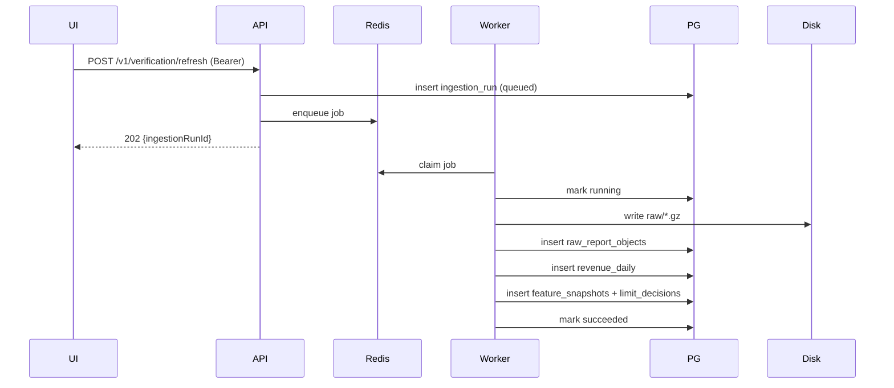

# Swiftpay architecture (prototype pipeline)

## Components

| Component | Role |
|-----------|------|
| `src/` (Vite React) | Product UI (unchanged contract with mock numbers unless wired to API). |
| `api/` | Fastify REST API: onboarding, credential vaulting, enqueue ingestion, read status/limits. |
| `worker/` | BullMQ consumers: ingestion pipeline + settlement reconciliation jobs. |
| `packages/core` | AES-GCM credential encryption, gzip TSV parser v1, deterministic mock “Apple” payloads. |
| `packages/policy` | Pure limit engine + tests (trailing revenue, CV, staleness, reason codes). |
| Postgres | System of record: tenants, runs, raw object index, ledger, snapshots, decisions. |
| Redis | BullMQ transport + backoff/retry semantics from the library. |
| `data/raw/…` | Immutable gzipped artifacts (local dev); swap for S3 in production. |

## Data flow

1. Developer created (`POST /v1/developers`) → API key issued once (bcrypt hash stored).
2. Developer exchanges API key for JWT (`POST /v1/auth/token`).
3. Developer uploads ASC credentials (`POST /v1/apple-credentials`) → private key encrypted at rest (`ENCRYPTION_KEY`).
4. Developer triggers refresh (`POST /v1/verification/refresh`) → `ingestion_runs` row + BullMQ job `{ developerId, ingestionRunId }`.
5. Worker marks run `running`, materializes reports (mock or future ASC client), writes gz to disk, inserts `raw_report_objects` idempotently (`UNIQUE (developer_id, report_identifier)`).
6. Parser v1 expands rows into `revenue_daily` idempotently (`UNIQUE (developer_id, source_raw_report_id, row_fingerprint)`).
7. Worker aggregates ledger → `@swiftpay/policy` → inserts `feature_snapshots` + `limit_decisions` with explainability JSON.
8. On failure: run marked `failed`; **previous** `limit_decisions` remain the latest successful decision for `GET /v1/limits`.
9. Funding transition dispatches payout through provider adapter (`internal_stub` or `stripe`) and persists disbursement events.
10. Provider webhooks are recorded in `webhook_events`; settlement events are queued to `swiftpay-settlement` for async reconciliation.

## Payout provider + webhook security

- Stripe webhook signature verification uses `STRIPE_WEBHOOK_SECRET`.
- Mutating routes enforce idempotency keys and route-level rate limits.
- Rotate `JWT_SECRET`, `ENCRYPTION_KEY`, `PAYOUT_WEBHOOK_SECRET`, and Stripe secrets before production cutover.

## Threat model (basics)

- **Secrets**: JWT signing secret, encryption key, DB credentials only on server; never ship to browser.
- **Tenant isolation**: every query filters by `developer_id` from verified JWT `sub`.
- **Poison files**: parser failures fail the run without deleting historical ledger rows; operators requeue after fix.
- **TODO(counsel)**: licensing, consumer disclosures, repayment enforcement—see explainability `TODO` markers in code.

## Operational limits (Apple)

- Real ASC ingestion is stubbed: set `APPLE_MOCK=false` currently errors until downloader is implemented.
- Finance multi-currency, refunds, and cross-region reporting need richer parsers than v1 TSV.

## Sequence (refresh)

